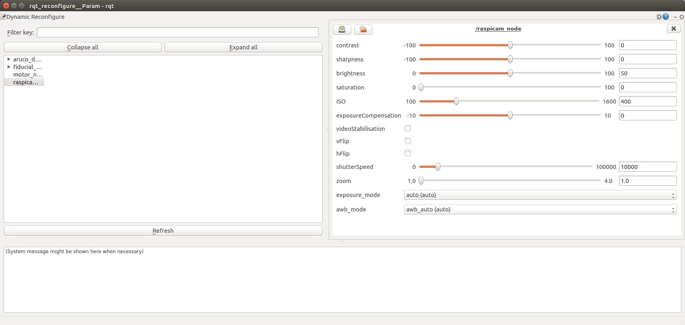

# raspicam_node

ROS node for the Raspberry Pi Camera Module. Works with both the V1.x and V2.x versions of the module. We recommend using the v2.x cameras as they have better auto gain, and the general image quality is better.

## Installation

A binary can be found at https://packages.ubiquityrobotics.com/ follow the instructions there to add the repository.

Then run `sudo apt install ros-kinetic-raspicam-node`

## Build Intructions
If you want to build from source instead of using the binary follow this section.

This node is primarily supported on ROS Kinetic, and Ubuntu 16.04, and that is what these instuctions presume.

Go to your catkin_ws `cd ~/catkin_ws/src`.

Download the source for this node by running

`git clone https://github.com/UbiquityRobotics/raspicam_node.git`

There are some dependencies that are not recognized by ros, so you need to create the file `/etc/ros/rosdep/sources.list.d/30-ubiquity.list` and add this to it.
```
yaml https://raw.githubusercontent.com/UbiquityRobotics/rosdep/master/raspberry-pi.yaml
```

Then run `rosdep update`.

Install the ros dependencies,

```
cd ~/catkin_ws
rosdep install --from-paths src --ignore-src --rosdistro=kinetic -y
```

Compile the code with `catkin_make`.

## Running the Node
Once you have the node built, you can run it using a launch file.

For a V2.x camera, run `roslaunch raspicam_node camerav2_1280x960.launch`

For a V1.x camera, run `roslaunch raspicam_node camerav1_1280x720.launch`

Use `rqt_image_view` on a connected computer to view the published image.

## Configuring the node with dynamic reconfigure
The `raspicam_node` supports dynamically reconfiguring the camera parameters.

Run the dynamic reconfigure node on a connected computer:

```
rosrun rqt_reconfigure rqt_reconfigure
```

It should bring up a user interface like the one below.  Paramaters can be dynamically adjusted via this interface.




## Troubleshooting
1. Make sure that your user is in the `video` group by running `groups|grep video`.

2. If you get an error saying: `Failed to create camera component`,
make sure that the camera cable is properly seated on both ends, and that the cable is not missing any pins.

3. If the publish rate of the image over the network is lower than expected, consider using a lower resolution to reduce the amount of bandwidth required.

## Node Information

Topics:

* `~/image/compressed`:
  Publishes `sensor_msgs/CompressedImage` with jpeg from the camera module.

* `~/image`:
  Publishes `sensor_msgs/Image` from the camera module (if parameter `enable_raw` is set).

* `~/motion_vectors`:
  Publishes `raspicam_node/MotionVectors` from the camera module (if parameter `enable_imv` is set).

* `~/camera_info`:
  Publishes `sensor_msgs/CameraInfo` camera info for each frame.

Services:

* `~/set_camera_info`: Used to update calibration info for the camera.

Parameters:

* `~private_topics` (bool): By default the topics are private, meaning the node name will be added in front of every topic name.
If you don't want the topics to be private, you can set this parameter to "true".
This parameter is mainly present in order to keep backward compatibility.

* `~camera_frame_id` (tf frame): The frame identifier to associate the camera.

* `~camera_info_url`: The URL of the camera calibration `.yaml` file.

* `~camera_name` (string): The name of the camera, should match with name in camera_info file.

* `~framerate` (fps): Framerate to capture at. Maximum 90fps

* `~height` (pixels): Height to capture images at.

* `~width` (pixels): Width to capture images at.

* `~quality` (0-100): Quality of the captured images.

* `~enable_raw` (bool): Publish a raw image (takes more CPU and memory)

* `~enable_imv` (bool): Publish inline motion vectors computed by the GPU

* `~camera_id` (int): The camera id (only supported on Compute Module)

## Calibration

The raspicam_node package contains a calibration file for the raspberry
PI camera versions 1 and 2.

A tutorial
  [Monocular Camera Calibration tutorial](http://wiki.ros.org/camera_calibration/Tutorials/MonocularCalibration)
shows how to calibrate a single camera.

The
  [8x6 checkerboard](http://wiki.ros.org/camera_calibration/Tutorials/StereoCalibration?action=AttachFile&do=view&target=check-108.pdf)
and the
  [7x6 checkerboard](http://wiki.ros.org/camera_calibration/Tutorials/StereoCalibration?action=AttachFile&do=view&target=check_7x6_108mm.pdf)
are rather large and require specialized printers to print out at
full scale.  They can be printed on more common printer sizes
with auto scaling turned on.  Be sure to carefully measure the
square size in millimeters and convert to meters by dividing by 1000.

Running calibration requires raw publishing enabled. Add `enable_raw:=true` to the camera roslaunch command.

If you are not sure which launch file to use `camerav2_1280x960_10fps.launch` is probably what you are looking for.

On the Pi
```
roslaunch raspicam_node camerav2_1280x960_10fps.launch enable_raw:=true
```

On your workstation:
```
rosrun camera_calibration cameracalibrator.py --size 8x6 --square 0.074 image:=/raspicam_node/image camera:=/raspicam_node
```

## Motion vectors

The raspicam_node is able to output [motion vectors](https://www.raspberrypi.org/blog/vectors-from-coarse-motion-estimation/) calculated by the Raspberry Pi's hardware video encoder. These motion vectors can be used for various applications such as motion detection.

On the Pi, add `enable_imv:=true` to the camera roslaunch command:

```
roslaunch raspicam_node camerav2_410x308_30fps.launch enable_imv:=true
```

On your workstation, build raspicam_node so that the `MotionVectors` ROS message is recognized by Python:

```
cd ~/catkin_ws
catkin_make
source ~/catkin_ws/devel/setup.bash
```

Finally, run script `imv_view.py` to visualize the motion vectors:

```
rosrun raspicam_node imv_view.py
```
